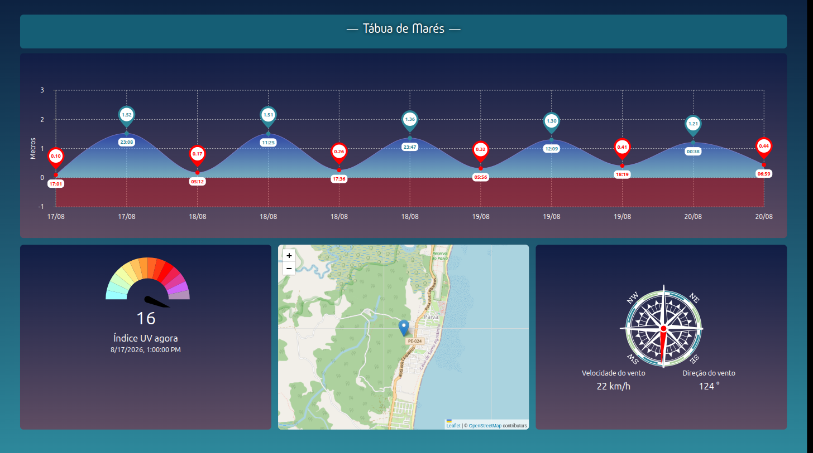
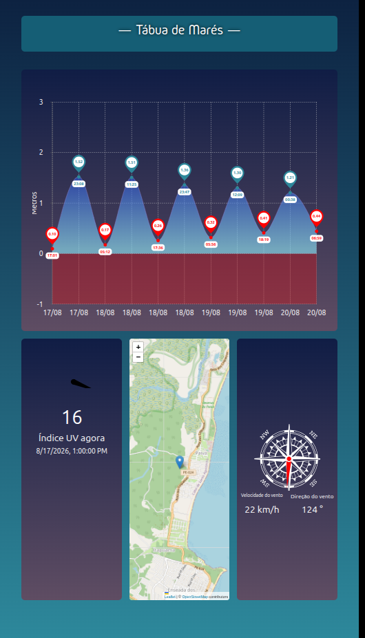
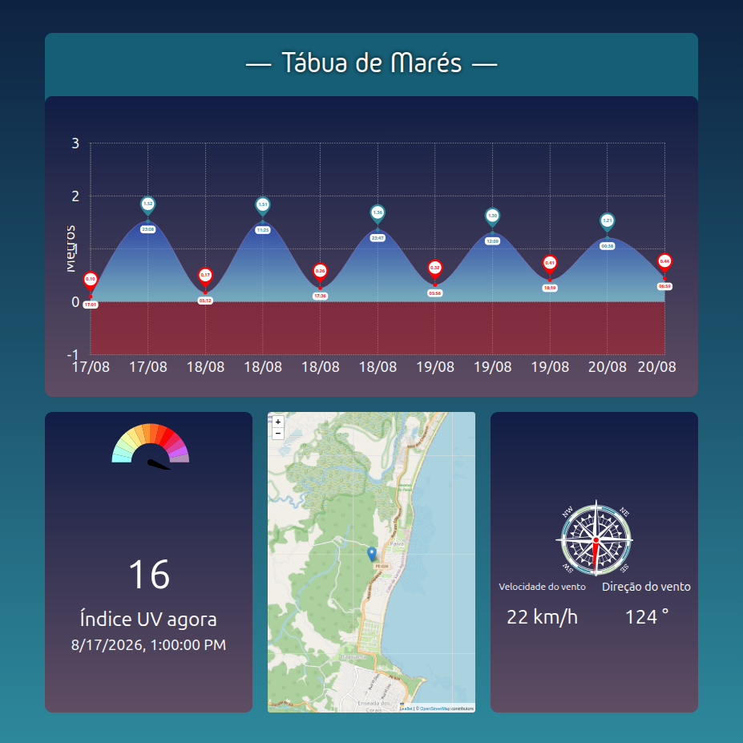

# DSPLAY - Tide Sheet Template

A [React](https://reactjs.org/) [HTML-based template](https://developers.dsplay.tv/docs/html-templates) for the [DSPLAY - Digital Signage](https://dsplay.tv/) platform — shows a live tide chart, a map, solar UV data, and wind data for a configured coastal location, sourced from the [Storm Glass](https://stormglass.io/) API.

> Built with [Vite](https://vitejs.dev/), requires Node.js 22.22.2+, 24.15.0+, or 26+ (see `.nvmrc`).

## Supported screen formats

| Landscape | Portrait | Square |
|-----------|----------|--------|
|  |  |  |

> Horizontal and vertical banner formats are omitted: this template's fixed grid (tide chart on top, map/UV gauge/wind compass row below) doesn't adapt to extreme aspect ratios. At the horizontal banner height, the chart's data and axis collapse to nothing and the bottom row is clipped to slivers. At the vertical banner width, the wind gauge and compass panels get pushed off-screen and overlap the map (confirmed via `getBoundingClientRect()` showing the compass extending ~60px past the 200px-wide viewport and the UV gauge shifted ~85px off-screen to the left).

## Features

- Tide extremes chart (high/low tide heights over the next few days).
- Map centered on the configured coordinate (OpenStreetMap via Leaflet).
- Hourly UV index gauge.
- Hourly wind speed/direction compass gauge.

## Template variables

| Key                  | Type   | Description                                                                 |
|-----------------------|--------|-------------------------------------------------------------------------------|
| `latitude`            | string | Latitude of the location to show tide/solar/wind data for.                   |
| `longitude`           | string | Longitude of the location to show tide/solar/wind data for.                  |
| `storm_glass_api_key` | string | API key for [Storm Glass](https://stormglass.io/), used for all data fetches. |

> Remember to also register these as Template Vars (same name and type) when configuring this template in the DSPLAY CMS.

> New variable names should use `snake_case` (e.g. `background_color`, not `backgroundColor`) — the DSPLAY CMS Manager auto-generates each variable's label from its key, and snake_case reads more naturally there.

## Local development

```sh
npm install
npm start
```

`public/dsplay-data.js` defines `dsplay_config`/`dsplay_media`/`dsplay_template` mock globals used only when the template isn't running inside the actual DSPLAY app. Edit it to try out a different location — the DSPLAY Player App replaces it with real content at runtime.

## Packing (release build)

```sh
npm run zip
```

This builds the template with Vite, which also generates `template-variables.json` + `template-example-data.json` (via [@dsplay/template-manifest](https://www.npmjs.com/package/@dsplay/template-manifest)'s Vite plugin) — the DSPLAY CMS reads these two files to auto-detect this template's variables and seed default preview values. It then generates `template.zip`, ready to be deployed to the [DSPLAY Web Manager](https://manager.dsplay.tv/template/create).

## Test assets

To use test assets (images, videos, etc) during development, put them in the `public/test-assets` folder and reference them in `dsplay-data.js` using their relative path. `public/test-assets` is automatically excluded from the release build.

## Maintaining dependencies

Regular npm dependencies, not vendored files:

```sh
npm outdated
npm update
```

For a version outside the declared range (typically a major bump), apply it deliberately and verify `npm start`, `npm run build`, and `npm test` still work before committing.

### Commit conventions

See [AGENTS.md](AGENTS.md).

## More

To see more about DSPLAY HTML Templates, visit: https://developers.dsplay.tv/docs/html-templates
